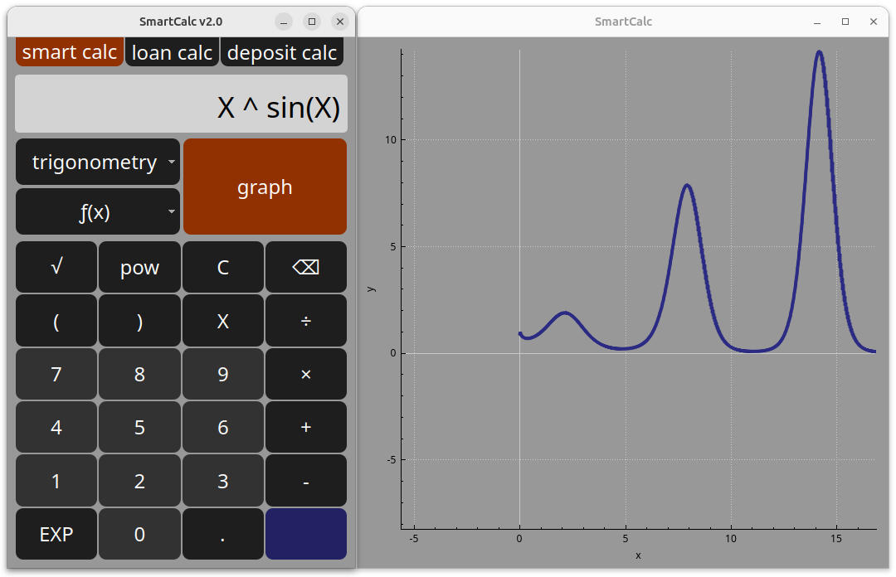
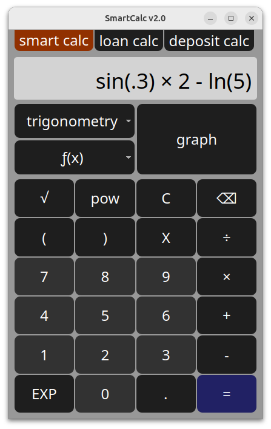
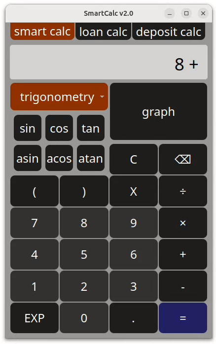
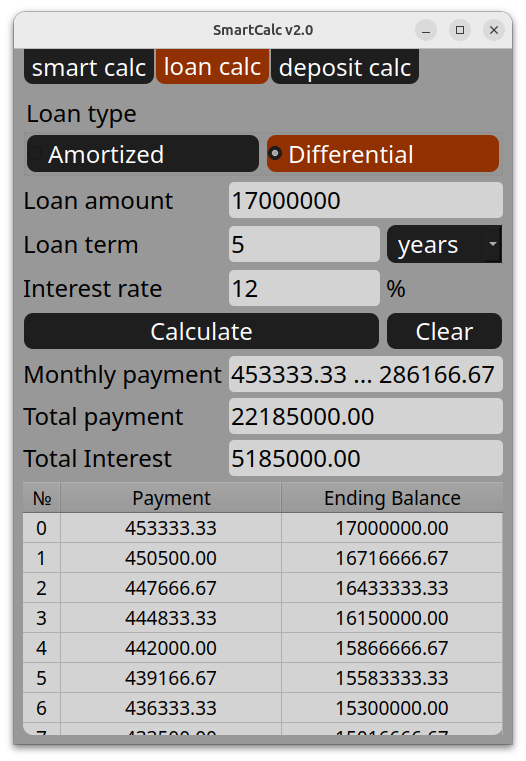
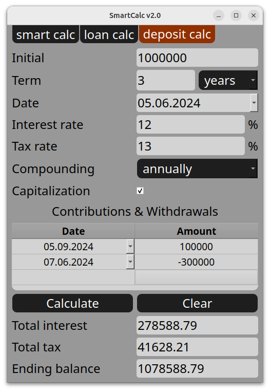

# SmartCalc

## Main part

A few words about the project

- The program is developed in C++ language of C++17 standard

- Code style - Google style for C++ https://google.github.io/styleguide/cppguide.html

- There is full coverage of expression calculation modules with unit-tests using the GTest library

- Makefile targets: all, install, uninstall, clean, dvi, dist, tests

- GUI implementation - QT

- Used MVC pattern

Mini user guide:

- Every button has a shortcut:
  - Digits - it's obvious
  - Brackets - '(', ')'
  - Clear - 'Del'
  - Power - '^'
  - Square - 's','q','r','t' (press one by one)
  - X - 'x'
  - Erase - backspace
  - Division, multiplication, subtraction, addition - '/', '*', '-', '+'
  - Dot - '.'
  - Exponent - 'e'
  - Equals - '='
  - Trigonometry button group - 'Ctrl' + 't'
    - Sin - 's', 'i', 'n' (one by one)
    - Cos - 'c', 'o', 's' (one by one)
    - Tan - 't', 'a', 'n' (one by one)
    - Asin - 'a', 's', 'i', 'n' (one by one)
    - Acos - 'a', 'c', 'o', 's' (one by one)
    - Atan - 'a', 't', 'a', 'n' (one by one)
  - Trigonometry button group - 'Ctrl' + 'f'
    - Log (base 10) - 'l', 'o', 'g' (one by one)
    - Ln (natural logarithm) - 'l', 'n' (one by one)
    - Mod - 'm', 'o', 'd' (one by one)
  - Open graph - 'Ctrl' + 'g'

## Credit calculator

There is a special mode "credit calculator"
- Input: total credit amount, term, interest rate, type (annuity, differentiated)
- Output: monthly payment, overpayment on credit, total payment

## Deposit calculator

There is a special mode "deposit profitability calculator"
- Input: deposit amount, deposit term, interest rate, tax rate, periodicity of payments, capitalization of interest, replenishments list, partial withdrawals list
- Output: accrued interest, tax amount, deposit amount by the end of the term

### Screenshots

*Writing an expression*

*Opened trigonometry menu*

*Loan calc*

*Deposit calc*
